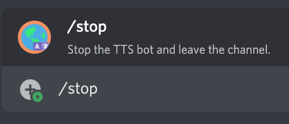

# /stop

!!! info "Aliases"
    You can also use the following as an alias for this command:

    * `/leave`

## 📖 Description

Stop the Text-to-Speech bot and make it leave the channel.

## ❓ Can Be Used By

Can be used by anyone in the server. You need to be inside the same voice channel as the bot to be able to make it stop.

## 🔨 Parameters

This command does not require any parameters.

## 🎈 Usage

You can run this command by typing:

```text
/stop
```

For example:



## ℹ️ Other Information

Some extra information to take into account:

* [x] Can only be run from a server.
* [ ] Can only be run from a NSFW channel.
* [ ] Saves data from the user.
