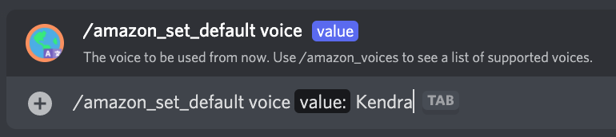

# /amazon_set_default

## 📖 Description

Sets the settings to be used by the [/say](../all-tts/say.md) and [/amazon_say](./amazon-say.md) commands by default. Default settings are used for people who have not set their own settings for the [Amazon Provider (TTS Tool)](../../text-to-speech-providers/amazon-ttstool.md).

If you're seeking to change your own settings for this provider, you should use [/amazon_set_my](./amazon-set-my.md).

## ❓ Can Be Used By

Can only be used by users with the `MANAGE_GUILD` permission.

## 🌎 Subcommand: `language`

### 🔨 Parameters

Running this command requires the following parameters:

* `<value>` - **Required**: The language code to use as the default [Amazon Provider (TTS Tool)](../../text-to-speech-providers/amazon-ttstool.md) language.

### 🎈 Usage

You can run this command by typing:

```text
/amazon_set_default language <value>
```

For example:


## 🗣 Subcommand: `voice`

### 🔨 Parameters

Running this command requires the following parameters:

* `<value>` - **Required**: The name of the voice to be used as the default [Amazon Provider (TTS Tool)](../../text-to-speech-providers/amazon-ttstool.md) voice.

### 🎈 Usage

You can run this command by typing:

```text
/amazon_set_default voice <value>
```

For example:



## 🔊 Subcommand: `volume`

### 🔨 Parameters

Running this command requires the following parameters:

* `<value>` - **Required**: The volume to use as the default [Amazon Provider (TTS Tool)](../../text-to-speech-providers/amazon-ttstool.md) volume. You can choose any of the suggested values when running the command.

### 🎈 Usage

You can run this command by typing:

```text
/amazon_set_default volume <value>
```

For example:


## 🏃🏻 Subcommand: `rate`

### 🔨 Parameters

Running this command requires the following parameters:

* `<value>` - **Required**: The rate to use as the default [Amazon Provider (TTS Tool)](../../text-to-speech-providers/amazon-ttstool.md) rate. You can choose any of the suggested values when running the command.

### 🎈 Usage

You can run this command by typing:

```text
/amazon_set_default rate <value>
```

For example:


## 🥁 Subcommand: `pitch`

### 🔨 Parameters

Running this command requires the following parameters:

* `<value>` - **Required**: The pitch to use as the default [Amazon Provider (TTS Tool)](../../text-to-speech-providers/amazon-ttstool.md) pitch. You can choose any of the suggested values when running the command.

### 🎈 Usage

You can run this command by typing:

```text
/amazon_set_default pitch <value>
```

For example:


## ℹ️ Other Information

Some extra information to take into account:

* [x] Can only be run from a server.
* [ ] Can only be run from a NSFW channel.
* [x] Saves data from the user.
    - [x] Saves the default settings for the [Amazon Provider (TTS Tool)](../../text-to-speech-providers/amazon-ttstool.md) for the server.
