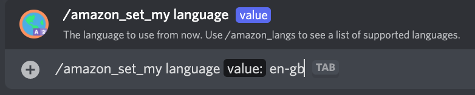
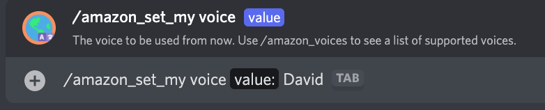
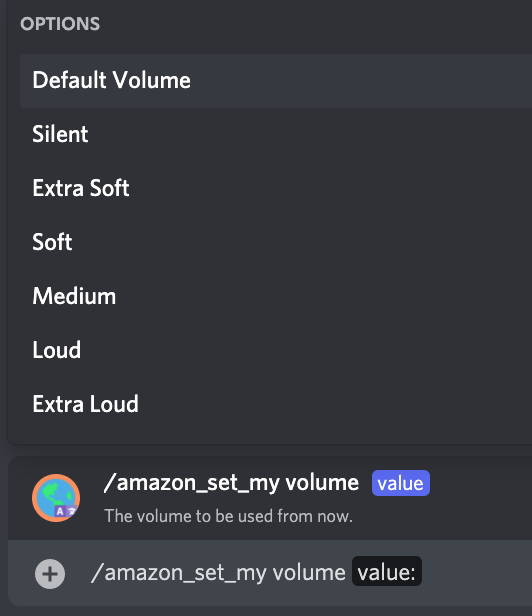
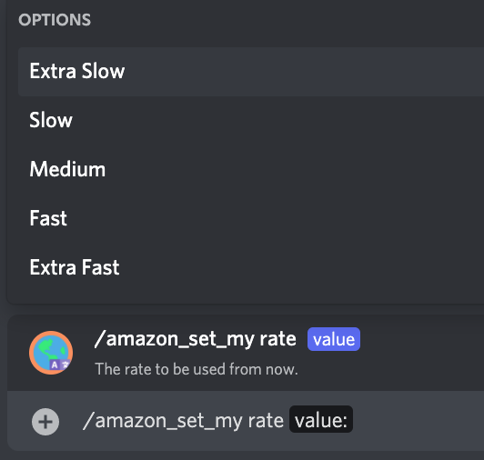
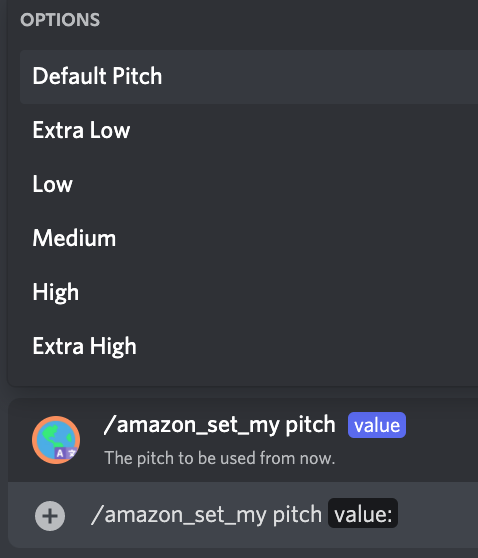

# /amazon_set_my

## 📖 Description

Sets the settings to be used by the [/say](../all-tts/say.md) and [/amazon_say](./amazon-say.md) commands for yourself.

If you're seeking to change the default server settings for this provider, you should use [/amazon_set_default](./amazon-set-default.md).

## ❓ Can Be Used By

Can be used by anyone in the server.

## 🌎 Subcommand: `language`

### 🔨 Parameters

Running this command requires the following parameters:

* `<value>` - **Required**: The language code to set for your [Amazon Provider (TTS Tool)](../../text-to-speech-providers/amazon-ttstool.md) language.

### 🎈 Usage

You can run this command by typing:

```text
/amazon_set_my language <value>
```

For example:



## 🗣 Subcommand: `voice`

### 🔨 Parameters

Running this command requires the following parameters:

* `<value>` - **Required**: The name of the voice to set as your [Amazon Provider (TTS Tool)](../../text-to-speech-providers/amazon-ttstool.md) voice.

### 🎈 Usage

You can run this command by typing:

```text
/amazon_set_my voice <value>
```

For example:



## 🔊 Subcommand: `volume`

### 🔨 Parameters

Running this command requires the following parameters:

* `<value>` - **Required**: The volume to set as your [Amazon Provider (TTS Tool)](../../text-to-speech-providers/amazon-ttstool.md) volume. You can choose any of the suggested values when running the command.

### 🎈 Usage

You can run this command by typing:

```text
/amazon_set_my volume <value>
```

For example:



## 🏃🏻 Subcommand: `rate`

### 🔨 Parameters

Running this command requires the following parameters:

* `<value>` - **Required**: The rate to set as your [Amazon Provider (TTS Tool)](../../text-to-speech-providers/amazon-ttstool.md) rate. You can choose any of the suggested values when running the command.

### 🎈 Usage

You can run this command by typing:

```text
/amazon_set_my rate <value>
```

For example:



## 🥁 Subcommand: `pitch`

### 🔨 Parameters

Running this command requires the following parameters:

* `<value>` - **Required**: The pitch to set as your [Amazon Provider (TTS Tool)](../../text-to-speech-providers/amazon-ttstool.md) pitch. You can choose any of the suggested values when running the command.

### 🎈 Usage

You can run this command by typing:

```text
/amazon_set_my pitch <value>
```

For example:



## ℹ️ Other Information

Some extra information to take into account:

* [x] Can only be run from a server.
* [ ] Can only be run from a NSFW channel.
* [x] Saves data from the user.
    - [x] Saves the settings for the [Amazon Provider (TTS Tool)](../../text-to-speech-providers/amazon-ttstool.md) for the user.
