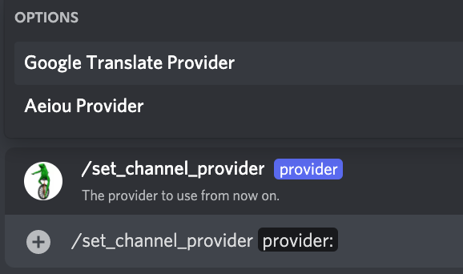

# /set_channel_provider

## 📖 Description

Sets the TTS provider to be used by the message-only based TTS on the channel that this command was run.

Using this command enables message-only based TTS on the channel. This means that after setting this, any message that is sent to that channel will be read by the bot inside the author's voice channel.

To disable this feature from the channel, run the [/delete_channel_provider](./delete-channel-provider.md) command.

!!! Warning "Keep in Mind"
    In order for this command to work properly, you need to have enabled the `GUILD_MESSAGES` privileged intent enabled in your bot's application page. Head over to [setting up](../../../installation/setting-up.md) for more information on how to enable this.

## ❓ Can Be Used By

Can only be used by users with the `MANAGE_CHANNELS` permission.

## 🔨 Parameters

Running this command requires the following parameters:

* `<provider>` - **Required**: The name of the provider to use. You can choose any of the suggested values when running the command.

## 🎈 Usage

You can run this command by typing:

```text
/set_channel_provider <provider>
```

For example:



## ℹ️ Other Information

Some extra information to take into account:

* [x] Can only be run from a server.
* [ ] Can only be run from a NSFW channel.
* [x] Saves data from the user.
    * [x] Saves the provider to be used for the channel.
