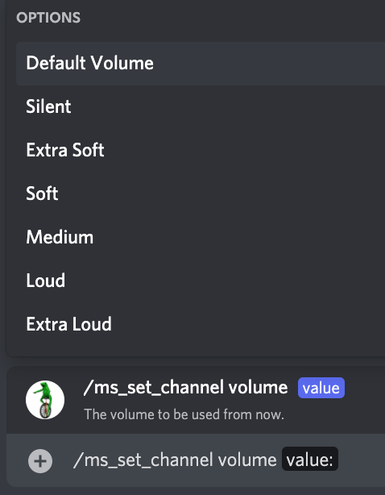
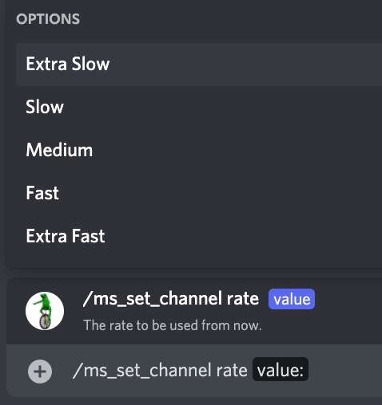
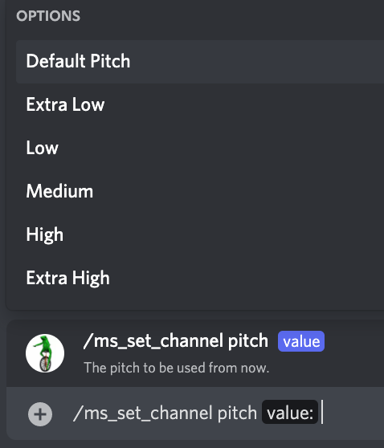

# /ms_set_channel

## 📖 Description

Sets the settings to be used by the message-only based TTS channel with the [Microsoft Provider (TTS Tool)](../../../text-to-speech-providers/microsoft-ttstool.md).

Run this command inside the channel you wish to change the settings for. Make sure to have set the TTS channel provider to [Microsoft Provider (TTS Tool)](../../../text-to-speech-providers/microsoft-ttstool.md) by running the [/set_channel_provider](../config/set-channel-provider.md) command inside the same channel.

Message-only based TTS bypasses the settings saved for the server or the user, it uses its own custom settings.

You can change the settings for any channel, just run this command inside that channel.

## ❓ Can Be Used By

Can only be used by users with the `MANAGE_CHANNELS` permission.

## 🌎 Subcommand: `language`

### 🔨 Parameters

Running this command requires the following parameters:

* `<value>` - **Required**: The language code to use as the [Microsoft Provider (TTS Tool)](../../../text-to-speech-providers/microsoft-ttstool.md) language for the channel.

### 🎈 Usage

You can run this command by typing:

```text
/ms_set_channel language <value>
```

For example:


## 🗣 Subcommand: `voice`

### 🔨 Parameters

Running this command requires the following parameters:

* `<value>` - **Required**: The name of the voice to be used as the [Microsoft Provider (TTS Tool)](../../../text-to-speech-providers/microsoft-ttstool.md) voice for the channel.

### 🎈 Usage

You can run this command by typing:

```text
/ms_set_channel voice <value>
```

For example:


## 🔊 Subcommand: `volume`

### 🔨 Parameters

Running this command requires the following parameters:

* `<value>` - **Required**: The volume to use as the [Microsoft Provider (TTS Tool)](../../../text-to-speech-providers/microsoft-ttstool.md) volume for the channel. You can choose any of the suggested values when running the command.

### 🎈 Usage

You can run this command by typing:

```text
/ms_set_channel volume <value>
```

For example:



## 🏃🏻 Subcommand: `rate`

### 🔨 Parameters

Running this command requires the following parameters:

* `<value>` - **Required**: The rate to use as the [Microsoft Provider (TTS Tool)](../../../text-to-speech-providers/microsoft-ttstool.md) rate for the channel. You can choose any of the suggested values when running the command.

### 🎈 Usage

You can run this command by typing:

```text
/ms_set_channel rate <value>
```

For example:



## 🥁 Subcommand: `pitch`

### 🔨 Parameters

Running this command requires the following parameters:

* `<value>` - **Required**: The pitch to use as the [Microsoft Provider (TTS Tool)](../../../text-to-speech-providers/microsoft-ttstool.md) pitch for the channel. You can choose any of the suggested values when running the command.

### 🎈 Usage

You can run this command by typing:

```text
/ms_set_channel pitch <value>
```

For example:



## ℹ️ Other Information

Some extra information to take into account:

* [x] Can only be run from a server.
* [ ] Can only be run from a NSFW channel.
* [x] Saves data from the user.
    - [x] Saves the settings for the [Microsoft Provider (TTS Tool)](../../../text-to-speech-providers/microsoft-ttstool.md) for the channel where the command was run.
