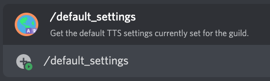

# /default_settings

## 📖 Description

Get some information regarding the default settings saved in the server for each TTS provider.

!!! warning "Keep in Mind"
    These settings reflect the ones that are default on the server. These are only applied when you haven't set your own settings with the corresponding command for a TTS provider.

    This means that these settings may not reflect what you actually have as your own.

## ❓ Can Be Used By

Can be used by anyone in the server.

## 🔨 Parameters

This command does not require any parameters.

## 🎈 Usage

You can run this command by typing:

```text
/default_settings
```

For example:



## ℹ️ Other Information

Some extra information to take into account:

* [x] Can only be run from a server.
* [ ] Can only be run from a NSFW channel.
* [ ] Saves data from the user.
