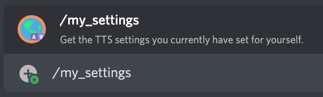

# /my_settings

## 📖 Description

Get some information regarding your settings saved for each TTS provider.

!!! warning "Keep in Mind"
    These settings will reflect what running the respective *say* commands will use. Even if you haven't set your own settings, this command will show the default ones if you haven't set your own settings before. This does not mean that you have your own settings saved.

## ❓ Can Be Used By

Can be used by anyone in the server.

## 🔨 Parameters

This command does not require any parameters.

## 🎈 Usage

You can run this command by typing:

```text
/my_settings
```

For example:



## ℹ️ Other Information

Some extra information to take into account:

* [x] Can only be run from a server.
* [ ] Can only be run from a NSFW channel.
* [ ] Saves data from the user.
