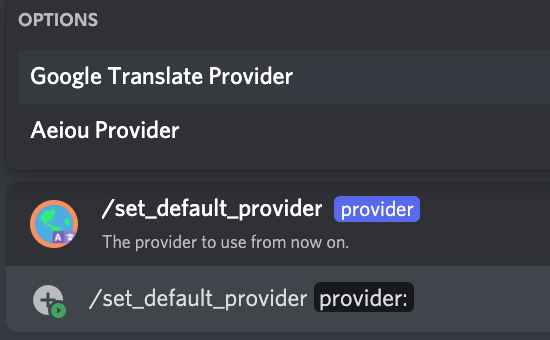

# /set_default_provider

## 📖 Description

Sets the default provider to be used for the server. This is used by the [/say](../all-tts/say.md) command for users who haven't set their own provider yet.

If you're looking to configure your own TTS provider, use [/set_my_provider](./set-my-provider.md).

## ❓ Can Be Used By

Can only be used by users with the `MANAGE_GUILD` permission.

## 🔨 Parameters

Running this command requires the following parameters:

* `<provider>` - **Required**: The name of the provider to use. You can choose any of the suggested values when running the command.

## 🎈 Usage

You can run this command by typing:

```text
/set_default_provider <provider>
```

For example:



## ℹ️ Other Information

Some extra information to take into account:

* [x] Can only be run from a server.
* [ ] Can only be run from a NSFW channel.
* [x] Saves data from the user.
    * [x] Saves the default provider to be used for the server.
