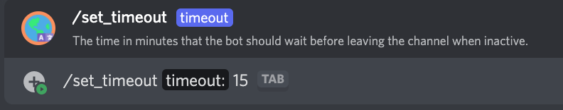

# /set_timeout

## 📖 Description

Sets the amount of time the bot should wait before leaving a voice channel when not in use.

If you haven't set this setting for your server, the bot will leave after a certain amount of time by default. This default value can easily be changed by the bot's hosting party. The official bot instance uses **10** minutes by default.

## ❓ Can Be Used By

Can only be used by users with the `MANAGE_GUILD` permission.

## 🔨 Parameters

Running this command requires the following parameters:

* `<timeout>` - **Required**: The time in minutes that the bot should wait before leaving a voice channel when not in use. This value can be between **5** and **300** inclusive.

## 🎈 Usage

You can run this command by typing:

```text
/set_timeout <timeout>
```

For example:



## ℹ️ Other Information

Some extra information to take into account:

* [x] Can only be run from a server.
* [ ] Can only be run from a NSFW channel.
* [x] Saves data from the user.
    * [x] Saves the timeout to be used for the server.
