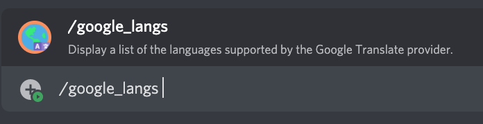

# /google_langs

## 📖 Description

Display a list of the languages supported by the [Google Translate Provider](../../text-to-speech-providers/google-translate.md).

You can use [/google_set_my](../google-tts/google-set-my.md) to change the language to be used by the [Google Translate Provider](../../text-to-speech-providers/google-translate.md) for yourself. To change the language to be used by default on the server (for people who have not set their own settings before), use [/google_set_default](../google-tts/google-set-default.md).

## ❓ Can Be Used By

Can be used by anyone in the server.

## 🔨 Parameters

This command does not require any parameters.

## 🎈 Usage

You can run this command by typing:

```text
/google_langs
```

For example:



## ℹ️ Other Information

Some extra information to take into account:

* [x] Can only be run from a server.
* [ ] Can only be run from a NSFW channel.
* [ ] Saves data from the user.
