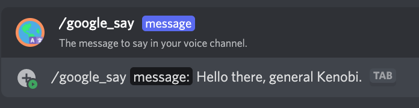

# /google_say

## 📖 Description

Send a Text-to-Speech message in your voice channel using the `Google Translate Provider` with your own settings or the ones saved as default for your server, regardless of what provider you have set as your own.

To configure the settings to be used by the `Google Translate Provider`, use [/google_set_my](../google-tts/google-set-my.md). To change the settings to be used by default on the server (for people who have not set their own settings before), use [/google_set_default](../google-tts/google-set-default.md).

If you insert a mention to a user, channel or role, the bot will read-out the name of the mentioned entity. Also, when using a custom emoji, the bot will read its name.

## ❓ Can Be Used By

Can be used by anyone in the server. You need to be inside a voice channel before to be able to *say* something.

Make sure that the bot has enough permissions to connect and speak in your voice channel.

## 🔨 Parameters

Running this command requires the following parameters:

* `<message>` - **Required**: The message to *say* in your voice channel.

## 🎈 Usage

You can run this command by typing:

```text
/google_say <message>
```

For example:



## ℹ️ Other Information

Some extra information to take into account:

* [x] Can only be run from a server.
* [ ] Can only be run from a NSFW channel.
* [ ] Saves data from the user.
