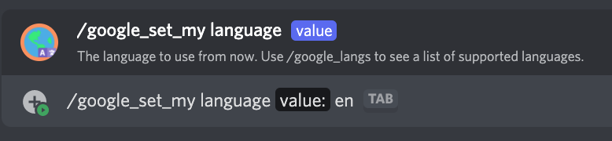
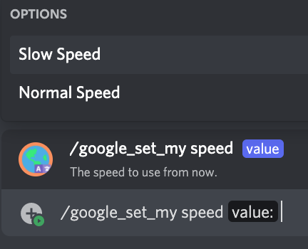

# /google_set_my

## 📖 Description

Sets the settings to be used by the [/say](../all-tts/say.md) and [/google_say](./google-say.md) commands for yourself.

If you're seeking to change the default server settings for this provider, you should use [/google_set_default](./google-set-default.md).

## ❓ Can Be Used By

Can be used by anyone in the server.

## 🌎 Subcommand: `language`

### 🔨 Parameters

Running this command requires the following parameters:

* `<value>` - **Required**: The language code to set for your `Google Translate Provider` settings.

### 🎈 Usage

You can run this command by typing:

```text
/google_set_my language <value>
```

For example:



## 🏃🏻 Subcommand: `speed`

### 🔨 Parameters

Running this command requires the following parameters:

* `<value>` - **Required**: The speed to use for your `Google Translate Provider` settings. You can choose any of the suggested values when running the command.

### 🎈 Usage

You can run this command by typing:

```text
/google_set_my speed <value>
```

For example:



## ℹ️ Other Information

Some extra information to take into account:

* [x] Can only be run from a server.
* [ ] Can only be run from a NSFW channel.
* [x] Saves data from the user.
    - [x] Saves the settings for the `Google Translate Provider` for the user.
