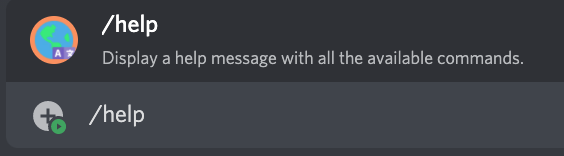

# /help

## 📖 Description

Display a help message with all the available commands.

!!! warning "Keep in Mind"
    The resulting message does not discriminate the user based on their permissions. This means that the message may include commands to which the user may not have access to.

## ❓ Can Be Used By

Can be used by anyone in the server.

## 🔨 Parameters

This command does not require any parameters.

## 🎈 Usage

You can run this command by typing:

```text
/help
```

For example:



## ℹ️ Other Information

Some extra information to take into account:

* [x] Can only be run from a server.
* [ ] Can only be run from a NSFW channel.
* [ ] Saves data from the user.
