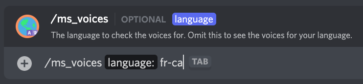

# /ms_voices

## 📖 Description

Display a list of the voices supported by the [Microsoft Provider (TTS Tool)](../../text-to-speech-providers/microsoft-ttstool.md).

You can use [/ms_set_my](./ms-set-my.md) to change the voice to be used by the [Microsoft Provider (TTS Tool)](../../text-to-speech-providers/microsoft-ttstool.md) for yourself. To change the voice to be used by default on the server (for people who have not set their own settings before), use [/ms_set_default](./ms-set-default.md).

## ❓ Can Be Used By

Can be used by anyone in the server.

## 🔨 Parameters

Running this command requires the following parameters:

* `<language>` - **Optional**: The language to check the voices for. If you don't include this, the command will display the available voices for the language you currently have set.

## 🎈 Usage

You can run this command by typing:

```text
/ms_voices <language?>
```

For example:



## ℹ️ Other Information

Some extra information to take into account:

* [x] Can only be run from a server.
* [ ] Can only be run from a NSFW channel.
* [ ] Saves data from the user.
